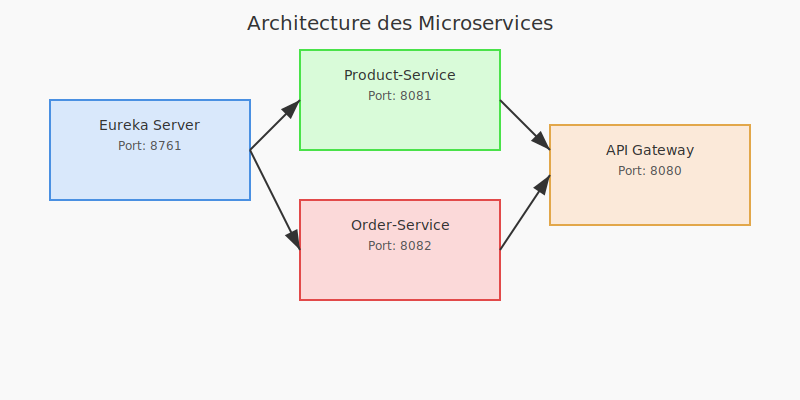

# Microservices Project

Ce projet démontre la communication entre microservices en utilisant Spring Cloud, Eureka, et une API Gateway. Il inclut plusieurs services indépendants qui collaborent pour fournir une architecture distribuée robuste.

## Stack Technique

### 1. **Eureka Server**

- **Rôle :** Serveur de découverte pour enregistrer et localiser les microservices.
- **Technologies :** Spring Cloud Netflix Eureka.
- **Port :** 8761.

### 2. **Product-Service**

- **Rôle :** Gère les produits.
- **Technologies :** Spring Boot, Eureka Client.
- **Port :** 8081.

### 3. **Order-Service**

- **Rôle :** Gère les commandes et communique avec `product-service` pour récupérer les informations produit.
- **Technologies :** Spring Boot, Eureka Client, RestTemplate.
- **Port :** 8082.

### 4. **API Gateway**

- **Rôle :** Point d'entrée unique pour toutes les requêtes vers les microservices.
- **Technologies :** Spring Cloud Gateway, Eureka Client.
- **Port :** 8080.

### 5. **Shared-Soap-Models**

- **Rôle :** Contient les modèles partagés pour les services SOAP.
- **Technologies :** JAXB, Maven.

## Architecture

L'architecture suit un modèle distribué avec les composants suivants :

- **Eureka Server** : Permet la découverte dynamique des services.
- **Microservices** : `product-service` et `order-service` s'enregistrent auprès d'Eureka et communiquent via des appels REST.
- **API Gateway** : Route les requêtes des clients vers les services appropriés.

Le diagramme ci-dessous illustre les interactions entre les différents composants de l'architecture :



### Détails du Diagramme

Le diagramme d'architecture représente l'organisation et les interactions entre les différents composants de votre projet de microservices. Voici une explication détaillée :

#### Eureka Server

- **Rôle** : Serveur de découverte qui agit comme un annuaire centralisé. Les microservices (`Product-Service` et `Order-Service`) s'y enregistrent dynamiquement.
- **Port** : 8761.
- **Interaction** : Les autres services communiquent avec Eureka pour découvrir les adresses des services disponibles.

#### Product-Service

- **Rôle** : Microservice responsable de la gestion des produits.
- **Port** : 8081.
- **Interaction** : S'enregistre auprès d'Eureka et peut être appelé par d'autres services via l'API Gateway.

#### Order-Service

- **Rôle** : Microservice responsable de la gestion des commandes. Il communique avec `Product-Service` pour récupérer des informations sur les produits.
- **Port** : 8082.
- **Interaction** : S'enregistre auprès d'Eureka et peut être appelé via l'API Gateway.

#### API Gateway

- **Rôle** : Point d'entrée unique pour toutes les requêtes des clients. Il route les requêtes vers les microservices appropriés (`Product-Service` ou `Order-Service`).
- **Port** : 8080.
- **Interaction** : Utilise Eureka pour découvrir dynamiquement les services disponibles et rediriger les requêtes.

### Flux de Communication

1. Les clients envoient leurs requêtes à l'API Gateway.
2. L'API Gateway interroge Eureka pour localiser les services nécessaires.
3. Les requêtes sont ensuite routées vers les microservices appropriés (`Product-Service` ou `Order-Service`).
4. Si nécessaire, `Order-Service` appelle `Product-Service` pour obtenir des informations supplémentaires.

Ce diagramme illustre une architecture distribuée typique basée sur Spring Cloud, avec une découverte de services dynamique et une gestion centralisée des routes via l'API Gateway.

## Installation et Exécution

### Prérequis

- **Java 17** ou version supérieure.
- **Maven** installé.
- **Port 8761**, **8080**, **8081**, et **8082** disponibles.

### Étapes

1. **Nettoyer le projet**

   ```bash
   mvn clean
   ```

2. **Installer les dépendances locales**

   ```bash
   mvn install -f shared-soap-models/pom.xml
   ```

3. **Démarrer les services**
   - **Eureka Server** :

     ```bash
     mvn spring-boot:run -f eureka-server/pom.xml
     ```

   - **Product-Service** :

     ```bash
     mvn spring-boot:run -f product-service/pom.xml
     ```

   - **Order-Service** :

     ```bash
     mvn spring-boot:run -f order-service/pom.xml
     ```

   - **API Gateway** :

     ```bash
     mvn spring-boot:run -f api-gateway/pom.xml
     ```

4. **Tester les services**
   - Accéder à Eureka Dashboard : [http://localhost:8761](http://localhost:8761)
   - Tester les endpoints via l'API Gateway :
     - `/products`
     - `/orders`

## Nettoyage

Pour nettoyer les artefacts générés :

```bash
mvn clean
```

## Documentation Complète

Pour plus de détails sur la configuration et la communication entre les services, consultez le fichier [DOCS.md](./DOCS.md).
